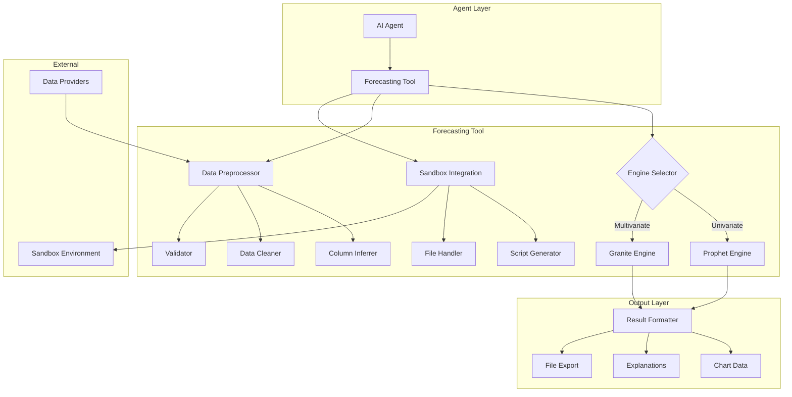

# Design Document: Data Forecasting Toolset

## Overview

The Data Forecasting Toolset provides AI agents with time series forecasting capabilities designed for non-technical users. It integrates two forecasting engines:

1. **Prophet Engine**: Facebook's Prophet library for univariate forecasting with automatic seasonality detection
2. **Granite Engine**: IBM's Granite Time Series Model (TTM) for multivariate forecasting with inter-channel dependencies

The toolset handles messy real-world data through automatic cleaning, column inference, and sandbox-based Python script execution. It produces chart-compatible outputs with plain-language explanations.

## Architecture



## Components and Interfaces

### 1. ForecastingTool (Main Tool Class)

The primary tool class extending `Tool` from `core.agentpress.tool`.

```python
@tool_metadata(
    display_name="Data Forecasting",
    description="Time series forecasting with automatic data cleaning and plain-language explanations",
    icon="TrendingUp",
    color="bg-purple-100 dark:bg-purple-800/50",
    weight=130,
    visible=True
)
class ForecastingTool(Tool):
    """Tool for time series forecasting with Prophet and IBM Granite TTM."""
```

**Methods:**
- `forecast(data, target_columns, timestamp_column, prediction_length, ...)` - Main forecasting endpoint
- `prepare_data(file_path, transformations)` - Sandbox-based data preparation
- `get_forecast_templates()` - List available data preparation templates
- `explain_forecast(forecast_result)` - Generate plain-language explanations

### 2. DataPreprocessor

Handles data cleaning, validation, and column inference.

```python
class DataPreprocessor:
    def infer_columns(self, data: pd.DataFrame) -> ColumnMapping
    def clean_data(self, data: pd.DataFrame, config: CleaningConfig) -> CleanedData
    def validate_data(self, data: pd.DataFrame) -> ValidationResult
    def detect_frequency(self, timestamps: pd.Series) -> str
```

### 3. ProphetEngine

Wrapper around Facebook Prophet for univariate forecasting. Uses Prophet's native JSON serialization for model persistence.

```python
from prophet import Prophet
from prophet.serialize import model_to_json, model_from_json

class ProphetEngine:
    def fit(self, data: pd.DataFrame, config: ProphetConfig) -> Prophet:
        """
        Fit Prophet model to data.
        
        Data must have columns 'ds' (datetime) and 'y' (value).
        """
        m = Prophet(
            seasonality_mode=config.seasonality_mode,  # 'additive' or 'multiplicative'
            yearly_seasonality=config.yearly_seasonality,
            weekly_seasonality=config.weekly_seasonality,
            daily_seasonality=config.daily_seasonality,
            interval_width=config.confidence_interval
        )
        
        # Add custom seasonalities if specified
        for seasonality in config.custom_seasonalities:
            m.add_seasonality(
                name=seasonality.name,
                period=seasonality.period,
                fourier_order=seasonality.fourier_order,
                prior_scale=seasonality.prior_scale
            )
        
        m.fit(data)
        return m
    
    def predict(self, model: Prophet, periods: int, freq: str = 'D') -> pd.DataFrame:
        """Generate forecast for future periods."""
        future = model.make_future_dataframe(periods=periods, freq=freq)
        return model.predict(future)
    
    def serialize(self, model: Prophet) -> str:
        """Serialize model to JSON (recommended over pickle)."""
        return model_to_json(model)
    
    def deserialize(self, model_json: str) -> Prophet:
        """Deserialize model from JSON."""
        return model_from_json(model_json)

@dataclass
class ProphetConfig:
    seasonality_mode: str = 'additive'  # 'additive' or 'multiplicative'
    yearly_seasonality: Union[bool, int] = True  # True/False or Fourier order
    weekly_seasonality: Union[bool, int] = True
    daily_seasonality: Union[bool, int] = 'auto'
    confidence_interval: float = 0.95
    custom_seasonalities: List[SeasonalityConfig] = field(default_factory=list)

@dataclass
class SeasonalityConfig:
    name: str
    period: float  # e.g., 30.5 for monthly
    fourier_order: int = 5
    prior_scale: float = 10.0
```

### 4. GraniteEngine

Wrapper around IBM Granite Time Series Model (TTM) for multivariate forecasting with inter-channel dependencies.

**Note:** Granite TTM runs **on-device** (locally), not as an API call. It uses Hugging Face Transformers and can run on CPU or GPU. The model is downloaded from Hugging Face Hub on first use.

```python
import torch
from tsfm_public.models.tinytimemixer import TinyTimeMixerForPrediction
from tsfm_public.toolkit.time_series_preprocessor import TimeSeriesPreprocessor

class GraniteEngine:
    MODEL_ID = "ibm-granite/granite-timeseries-ttm-r2"
    
    def __init__(self, device: Optional[str] = None):
        self.preprocessor = None
        self.model = None
        # Auto-detect device: use CUDA if available, else CPU
        self.device = device or ("cuda" if torch.cuda.is_available() else "cpu")
    
    def fit(self, data: pd.DataFrame, config: GraniteConfig) -> 'GraniteEngine':
        """
        Configure and prepare Granite TTM for prediction.
        
        Note: Granite TTM is a pretrained model - we configure it for the data
        rather than training from scratch. Model runs locally on CPU/GPU.
        """
        # Configure preprocessor
        self.preprocessor = TimeSeriesPreprocessor(
            id_columns=config.id_columns or [],
            timestamp_column=config.timestamp_column,
            target_columns=config.target_columns,
            control_columns=config.control_columns or [],
            prediction_length=config.prediction_length,
            context_length=config.context_length,
            scaling=True,
            scaling_type="standard"
        )
        
        # Prepare data
        self.preprocessor.train(data)
        
        # Load pretrained model with configuration (downloads from HF Hub on first use)
        self.model = TinyTimeMixerForPrediction.from_pretrained(
            self.MODEL_ID,
            num_input_channels=self.preprocessor.num_input_channels,
            prediction_channel_indices=self.preprocessor.prediction_channel_indices,
            exogenous_channel_indices=self.preprocessor.exogenous_channel_indices,
            decoder_mode="mix_channel"  # Enable inter-channel dependencies
        )
        
        # Move model to device
        self.model.to(self.device)
        self.model.eval()
        
        return self
    
    def predict(self, data: pd.DataFrame) -> pd.DataFrame:
        """Generate multivariate forecast (runs locally on CPU/GPU)."""
        # Preprocess input data
        processed = self.preprocessor.preprocess(data)
        
        # Move data to device
        processed = {k: v.to(self.device) for k, v in processed.items()}
        
        # Generate predictions (no gradient computation needed for inference)
        with torch.no_grad():
            predictions = self.model(processed)
        
        # Inverse transform to original scale
        return self.preprocessor.inverse_transform(predictions)
    
    def get_channel_relationships(self) -> Dict[str, List[str]]:
        """Return information about inter-channel dependencies."""
        return {
            "target_columns": self.preprocessor.target_columns,
            "control_columns": self.preprocessor.control_columns,
            "decoder_mode": "mix_channel",
            "device": self.device
        }

@dataclass
class GraniteConfig:
    timestamp_column: str
    target_columns: List[str]
    control_columns: Optional[List[str]] = None
    id_columns: Optional[List[str]] = None
    prediction_length: int = 96
    context_length: int = 512
    device: Optional[str] = None  # Auto-detect if None
```

### 5. SandboxScriptGenerator

Generates Python scripts for data preparation in the sandbox.

```python
class SandboxScriptGenerator:
    def generate_cleaning_script(self, issues: List[DataIssue]) -> str
    def generate_merge_script(self, sources: List[DataSource]) -> str
    def generate_template_script(self, template_name: str, params: Dict) -> str
```

### 6. ResultFormatter

Formats forecast results for charts and explanations.

```python
class ResultFormatter:
    def to_chart_data(self, result: ForecastResult) -> ChartData
    def generate_explanation(self, result: ForecastResult) -> str
    def to_csv(self, result: ForecastResult) -> str
```

## Data Models

### Input Models

```python
@dataclass
class ForecastRequest:
    data: Union[pd.DataFrame, str]  # DataFrame or file path
    target_columns: Optional[List[str]] = None  # Auto-inferred if not provided
    timestamp_column: Optional[str] = None  # Auto-inferred if not provided
    control_columns: Optional[List[str]] = None  # Exogenous variables
    prediction_length: Optional[int] = None  # Auto-inferred from horizon
    prediction_horizon: Optional[str] = None  # "next week", "next month", etc.
    confidence_interval: float = 0.95
    engine: Optional[str] = None  # "prophet", "granite", or auto-select
    seasonality_mode: str = "additive"  # For Prophet
    context_length: int = 512  # For Granite

@dataclass
class ColumnMapping:
    timestamp_column: str
    target_columns: List[str]
    control_columns: List[str]
    confidence: float  # How confident the inference is
    inferred: bool  # Whether columns were auto-detected

@dataclass
class CleaningConfig:
    parse_dates: bool = True
    handle_missing: str = "interpolate"  # "interpolate", "forward_fill", "drop"
    handle_duplicates: str = "average"  # "average", "first", "last"
    handle_outliers: str = "cap"  # "cap", "remove", "keep"
    outlier_threshold: float = 3.0  # Standard deviations
    resample_frequency: Optional[str] = None  # Auto-detect if None
```

### Output Models

```python
@dataclass
class ForecastResult:
    historical: pd.DataFrame  # Original data
    predictions: pd.DataFrame  # Forecasted values
    confidence_lower: pd.DataFrame  # Lower confidence bound
    confidence_upper: pd.DataFrame  # Upper confidence bound
    metadata: ForecastMetadata
    explanation: str  # Plain-language summary

@dataclass
class ForecastMetadata:
    engine_used: str
    prediction_length: int
    confidence_interval: float
    seasonality_detected: List[str]
    trend_direction: str  # "increasing", "decreasing", "stable"
    changepoints: List[datetime]
    data_frequency: str
    training_date: datetime

@dataclass
class ChartData:
    labels: List[str]  # Timestamps as strings
    datasets: List[ChartDataset]

@dataclass
class ChartDataset:
    label: str
    data: List[float]
    type: str  # "historical", "prediction", "confidence_upper", "confidence_lower"
    borderColor: str
    backgroundColor: str
    fill: Optional[str]  # For confidence bands

@dataclass
class ValidationResult:
    is_valid: bool
    issues: List[DataIssue]
    statistics: DataStatistics

@dataclass
class DataIssue:
    severity: str  # "error", "warning", "info"
    issue_type: str
    description: str
    affected_rows: Optional[List[int]]
    suggestion: str

@dataclass
class DataStatistics:
    row_count: int
    date_range: Tuple[datetime, datetime]
    frequency: str
    columns: Dict[str, ColumnStats]

@dataclass
class ColumnStats:
    dtype: str
    min_value: float
    max_value: float
    mean: float
    null_count: int
    unique_count: int
```


## Correctness Properties

*A property is a characteristic or behavior that should hold true across all valid executions of a system-essentially, a formal statement about what the system should do. Properties serve as the bridge between human-readable specifications and machine-verifiable correctness guarantees.*

### Property 1: Engine Selection for Univariate Data
*For any* time series data with a single target column and no control columns, the Forecasting_Tool should select the Prophet_Engine for forecasting.
**Validates: Requirements 1.1, 6.1**

### Property 2: Engine Selection for Multivariate Data
*For any* time series data with multiple target columns OR control columns, the Forecasting_Tool should select the Granite_Engine for forecasting.
**Validates: Requirements 2.1, 6.2, 6.3**

### Property 3: Explicit Engine Override
*For any* forecast request with an explicit engine parameter, the Forecasting_Tool should use the specified engine regardless of data characteristics.
**Validates: Requirements 6.4**

### Property 4: Prediction Length Consistency
*For any* valid prediction_length parameter N, the forecast output should contain exactly N predicted time steps.
**Validates: Requirements 1.4, 5.2**

### Property 5: Forecast Output Structure
*For any* successful forecast, the result should contain: historical values, predicted values, upper confidence bound, lower confidence bound, and timestamps covering both historical and predicted periods.
**Validates: Requirements 1.3, 4.1, 4.2, 4.3**

### Property 6: Confidence Bounds Ordering
*For any* forecast with confidence intervals, the lower bound should be less than or equal to the predicted value, and the predicted value should be less than or equal to the upper bound, for all time steps.
**Validates: Requirements 1.3, 4.3**

### Property 7: Missing Value Handling
*For any* input data with missing values, the cleaned output should contain no missing values in the target columns.
**Validates: Requirements 3.3**

### Property 8: Duplicate Timestamp Aggregation
*For any* input data with duplicate timestamps, the cleaned output should have unique timestamps with values aggregated by averaging.
**Validates: Requirements 3.1.2**

### Property 9: Date Format Parsing
*For any* date string in ISO, US (MM/DD/YYYY), European (DD/MM/YYYY), or Unix timestamp format, the parser should successfully convert it to a datetime object.
**Validates: Requirements 3.1, 3.1.1**

### Property 10: Numeric String Conversion
*For any* string containing a numeric value with currency symbols ($, €, £), commas, or percentage signs, the converter should extract the correct numeric value.
**Validates: Requirements 3.1.4**

### Property 11: Regular Frequency Resampling
*For any* input data with irregular time intervals, the resampled output should have consistent time intervals between consecutive timestamps.
**Validates: Requirements 3.1.5**

### Property 12: Column Inference for Timestamps
*For any* DataFrame with a column named containing "date", "time", "timestamp", "created_at", or "period", the column inferrer should identify it as a timestamp candidate.
**Validates: Requirements 3.2.1**

### Property 13: Column Inference for Numeric Values
*For any* DataFrame with numeric columns, the column inferrer should identify all numeric columns as potential value columns.
**Validates: Requirements 3.2.2**

### Property 14: Natural Language Horizon Conversion
*For any* natural language time horizon ("next week", "next month", "next quarter", "next year"), the converter should produce the correct prediction_length based on data frequency.
**Validates: Requirements 5.1.1**

### Property 15: Model Serialization Round-Trip
*For any* trained Prophet model, serializing then deserializing should produce a model that generates identical predictions for the same input data.
**Validates: Requirements 8.1, 8.2, 8.3, 8.4**

### Property 16: Serialized Model Metadata
*For any* serialized model, the JSON output should contain training_date, data_characteristics, and parameters_used fields.
**Validates: Requirements 8.3**

### Property 17: Data Validation Completeness
*For any* prepared data, validation should verify: monotonically increasing timestamps, no null values in target columns, and consistent data frequency.
**Validates: Requirements 11.2.1, 11.2.2, 11.2.3**

### Property 18: Validation Statistics
*For any* successfully validated data, the result should include row_count, date_range, frequency, and column statistics.
**Validates: Requirements 11.2.5**

### Property 19: Forecast Explanation Completeness
*For any* forecast result, the explanation should include trend direction description, and if applicable, seasonality patterns, confidence interval meaning, and changepoint highlights.
**Validates: Requirements 5.1.5, 10.1, 10.2, 10.3, 10.4**

### Property 20: Multivariate Prediction Coverage
*For any* multivariate forecast with N target columns, the prediction output should contain forecasts for all N columns.
**Validates: Requirements 2.4**

### Property 21: Control Column Incorporation
*For any* forecast request with control columns, the Granite_Engine configuration should include those columns as exogenous_channel_indices.
**Validates: Requirements 2.3**

### Property 22: ToolResult Compliance
*For any* forecast operation (success or failure), the return value should be a ToolResult instance with appropriate success flag and output.
**Validates: Requirements 7.3**

### Property 23: Script Generation for Transformations
*For any* data transformation request, the SandboxScriptGenerator should produce a valid Python script using pandas.
**Validates: Requirements 11.1, 11.2**

### Property 24: File Read Support
*For any* valid file path with .csv, .xlsx, or .json extension in the sandbox, the Forecasting_Tool should successfully read and parse the data.
**Validates: Requirements 12.1**

### Property 25: Forecast File Export
*For any* completed forecast, the saved CSV file should contain both historical and predicted values with their timestamps.
**Validates: Requirements 12.2, 12.3**

## Error Handling

### Input Validation Errors

| Error Condition | Error Code | User-Friendly Message |
|----------------|------------|----------------------|
| Insufficient data (< 2 points) | `INSUFFICIENT_DATA` | "I need at least 2 data points to make a forecast. Your data has {n} points. Try adding more historical data." |
| No timestamp column found | `NO_TIMESTAMP` | "I couldn't find a date/time column in your data. Please make sure your data has a column with dates (like 'date', 'timestamp', or 'time')." |
| No numeric columns found | `NO_NUMERIC` | "I couldn't find any numeric columns to forecast. Please make sure your data has columns with numbers (like 'sales', 'price', or 'value')." |
| Unparseable dates | `DATE_PARSE_ERROR` | "I had trouble reading the dates in your data. I can read formats like '2024-01-15', '01/15/2024', or '15-Jan-2024'. Your dates look like: {sample}" |
| All values missing | `ALL_MISSING` | "The column '{column}' has no values. Please check your data and make sure it contains actual numbers." |

### Processing Errors

| Error Condition | Error Code | User-Friendly Message |
|----------------|------------|----------------------|
| Model training failed | `TRAINING_FAILED` | "I had trouble learning patterns from your data. This might happen if the data is too noisy or has unusual patterns. Try providing more data or checking for data quality issues." |
| Prediction failed | `PREDICTION_FAILED` | "I couldn't generate a forecast. This might be due to unusual patterns in your data. Let me try with different settings." |
| Sandbox execution failed | `SANDBOX_ERROR` | "I had trouble processing your data file. Please make sure the file is not corrupted and try again." |
| File not found | `FILE_NOT_FOUND` | "I couldn't find the file '{path}'. Please check the file path and make sure the file has been uploaded." |

### Warning Conditions

| Condition | Warning Message |
|-----------|-----------------|
| High uncertainty | "Note: This forecast has high uncertainty. The actual values could vary significantly from these predictions." |
| Short history | "Note: Your data covers a short time period. Forecasts work better with more historical data (at least 1-2 years for seasonal patterns)." |
| Outliers detected | "Note: I found some unusual values in your data that might affect the forecast. I've adjusted for them, but you may want to review: {outliers}" |
| Missing values filled | "Note: Your data had some missing values. I filled them in using interpolation to create a complete forecast." |

## Testing Strategy

### Property-Based Testing

The implementation will use **Hypothesis** as the property-based testing library for Python.

Each property-based test will:
- Run a minimum of 100 iterations
- Be tagged with a comment referencing the correctness property: `**Feature: data-forecasting-toolset, Property {number}: {property_text}**`
- Use smart generators that constrain inputs to valid time series data

### Test Categories

1. **Engine Selection Tests** (Properties 1-3)
   - Generate random DataFrames with varying column counts
   - Verify correct engine selection based on data characteristics

2. **Data Cleaning Tests** (Properties 7-11)
   - Generate data with various quality issues
   - Verify cleaning produces valid output

3. **Column Inference Tests** (Properties 12-13)
   - Generate DataFrames with various column naming patterns
   - Verify correct column role detection

4. **Forecast Structure Tests** (Properties 4-6, 20)
   - Generate valid time series data
   - Verify output structure and bounds ordering

5. **Serialization Tests** (Properties 15-16)
   - Train models on random data
   - Verify round-trip serialization preserves predictions

6. **Validation Tests** (Properties 17-18)
   - Generate data with various validation issues
   - Verify validation catches all issues

7. **Integration Tests** (Properties 22-25)
   - Test file I/O operations
   - Test ToolResult compliance

### Unit Tests

Unit tests will cover:
- Specific edge cases (empty data, single row, etc.)
- Error message formatting
- Natural language parsing for time horizons
- Template script generation

### Test Data Generators

```python
from hypothesis import strategies as st
import pandas as pd

@st.composite
def time_series_data(draw, min_rows=10, max_rows=1000, num_columns=1):
    """Generate random time series data for testing."""
    n_rows = draw(st.integers(min_value=min_rows, max_value=max_rows))
    n_cols = draw(st.integers(min_value=1, max_value=num_columns))
    
    # Generate timestamps
    start_date = draw(st.datetimes(min_value=datetime(2020, 1, 1), max_value=datetime(2024, 1, 1)))
    freq = draw(st.sampled_from(['D', 'W', 'M', 'H']))
    timestamps = pd.date_range(start=start_date, periods=n_rows, freq=freq)
    
    # Generate values
    data = {'timestamp': timestamps}
    for i in range(n_cols):
        base = draw(st.floats(min_value=0, max_value=1000))
        noise = draw(st.floats(min_value=0, max_value=100))
        values = [base + np.random.normal(0, noise) for _ in range(n_rows)]
        data[f'value_{i}'] = values
    
    return pd.DataFrame(data)

@st.composite
def messy_data(draw, base_data):
    """Add various data quality issues to clean data."""
    df = base_data.copy()
    
    # Optionally add missing values
    if draw(st.booleans()):
        missing_idx = draw(st.lists(st.integers(0, len(df)-1), max_size=len(df)//10))
        for idx in missing_idx:
            col = draw(st.sampled_from(df.columns[1:]))
            df.loc[idx, col] = np.nan
    
    # Optionally add duplicates
    if draw(st.booleans()):
        dup_idx = draw(st.integers(0, len(df)-1))
        df = pd.concat([df, df.iloc[[dup_idx]]])
    
    # Optionally add outliers
    if draw(st.booleans()):
        outlier_idx = draw(st.integers(0, len(df)-1))
        col = draw(st.sampled_from(df.columns[1:]))
        df.loc[outlier_idx, col] = df[col].mean() + 10 * df[col].std()
    
    return df
```

## Dependencies

### Python Packages

```toml
# Add to backend/pyproject.toml
[project.dependencies]
prophet = "^1.1.5"
hypothesis = "^6.100.0"  # For property-based testing
torch = "^2.0.0"  # Required for Granite TTM
```

```bash
# Install Granite TTM from GitHub (not on PyPI)
pip install "tsfm_public[notebooks] @ git+https://github.com/ibm-granite/granite-tsfm.git@v0.2.12"
```

### External Services

- Sandbox environment for script execution
- File storage for data files and results

## Implementation Notes

### Resource Requirements

#### Prophet (Lightweight)
- **Memory**: ~100-500 MB RAM depending on dataset size
- **CPU**: Single-threaded by default, uses Stan for optimization
- **Training Time**: Typically 1-10 seconds for datasets up to 10,000 rows
- **Inference Time**: Milliseconds per prediction
- **Warm-starting**: Can reuse parameters from previous model to speed up training by ~50%
- **MCMC Sampling**: If enabled (`mcmc_samples > 0`), significantly increases computation time but provides better uncertainty estimates

#### Granite TTM (Moderate)
- **Model Size**: TinyTimeMixer is a lightweight model (~10-50 MB)
- **Memory**: ~500 MB - 2 GB RAM (more with GPU)
- **GPU**: Optional but recommended for faster inference
- **CPU Inference**: 1-5 seconds per batch
- **GPU Inference**: ~100-500 ms per batch
- **First Load**: Model downloads from Hugging Face Hub on first use (~50-100 MB)
- **Context Length**: Default 512 points; longer contexts increase memory usage

#### Sandbox Considerations
- Both models can run in the sandbox environment
- For large datasets (>100,000 rows), consider streaming/chunking
- GPU acceleration requires CUDA-enabled sandbox

### Prophet Serialization
Prophet models should be serialized using `prophet.serialize.model_to_json()` rather than pickle. This is the recommended approach as it avoids issues with the Stan backend and ensures portability across environments.

### Granite TTM Configuration
The Granite TTM model uses `decoder_mode="mix_channel"` to enable inter-channel dependencies for multivariate forecasting. The `TimeSeriesPreprocessor` handles:
- Standard scaling of input features
- Separation of target vs control (exogenous) columns
- Context window management

### Seasonality Detection
Prophet automatically detects yearly, weekly, and daily seasonality. For custom seasonalities (e.g., monthly), use `add_seasonality()` with:
- `period`: Length of the seasonal cycle (e.g., 30.5 for monthly)
- `fourier_order`: Higher values capture more complex patterns but risk overfitting
- `prior_scale`: Controls regularization strength

### Multiplicative vs Additive Seasonality
- **Additive**: Seasonal effect is constant regardless of trend level (default)
- **Multiplicative**: Seasonal effect scales with trend level (use for data where seasonal swings grow with the trend, like airline passengers)
