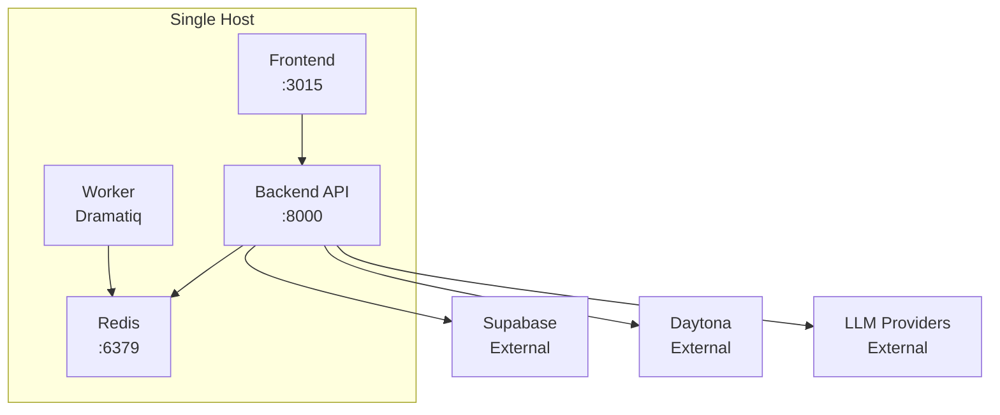
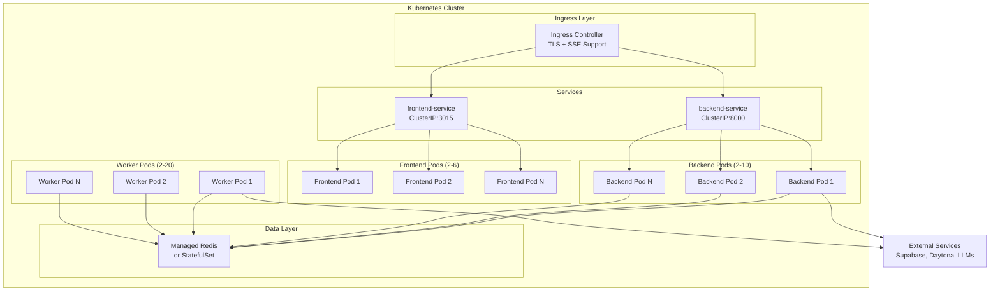

# Kubernetes Migration Design Document

## Overview

This document describes the technical design for migrating the Kortix/Suna application from Docker Compose to Kubernetes. The migration enables horizontal scaling, high availability, and production-grade orchestration while maintaining compatibility with existing external services (Supabase, Daytona).

## Architecture

### Current Architecture (Docker Compose)



### Target Architecture (Kubernetes)



## Components and Interfaces

### 1. Namespace (`kortix`)

All resources deployed in a dedicated namespace for isolation and resource management.

```yaml
apiVersion: v1
kind: Namespace
metadata:
  name: kortix
  labels:
    app.kubernetes.io/name: kortix
    app.kubernetes.io/part-of: suna
```

**Resource Quota (optional):**
```yaml
apiVersion: v1
kind: ResourceQuota
metadata:
  name: kortix-quota
  namespace: kortix
spec:
  hard:
    requests.cpu: "50"
    requests.memory: "100Gi"
    limits.cpu: "100"
    limits.memory: "200Gi"
    pods: "100"
```

### 2. Backend Deployment

The FastAPI backend runs with Gunicorn and handles:
- REST API requests
- SSE streaming for agent responses
- Health checks for K8s probes

**Key Configuration:**
- Image: `ghcr.io/suna-ai/suna-backend:latest`
- ImagePullPolicy: `Always` (for latest tag) or `IfNotPresent` (for versioned tags)
- Port: 8000
- Replicas: 2-10 (HPA)
- Resources: 500m-2 CPU, 1-4Gi memory
- Probes: `/api/health` (liveness), `/api/health-docker` (readiness)
- Graceful shutdown: 120s

**Rolling Update Strategy:**
```yaml
strategy:
  type: RollingUpdate
  rollingUpdate:
    maxSurge: 1
    maxUnavailable: 0  # Zero-downtime deployments
```

### 3. Worker Deployment

Dramatiq workers process background agent tasks from Redis queue.

**Key Configuration:**
- Image: `ghcr.io/suna-ai/suna-backend:latest`
- Command: `["uv", "run", "dramatiq", "--processes", "4", "--threads", "4", "run_agent_background"]`
- Replicas: 2-20 (HPA based on CPU, custom metrics future)
- Resources: 1-4 CPU, 2-8Gi memory
- Probe: exec `["uv", "run", "worker_health.py"]` (timeout: 30s, period: 30s)
- Graceful shutdown: 600s (long-running agent tasks)

**Lifecycle Hooks:**
```yaml
lifecycle:
  preStop:
    exec:
      command: ["sleep", "10"]  # Allow graceful drain
terminationGracePeriodSeconds: 600
```

### 4. Frontend Deployment

Next.js 15 application serving the dashboard UI.

**Key Configuration:**
- Image: Built from `frontend/Dockerfile`
- Port: 3015
- Replicas: 2-6 (HPA)
- Resources: 250m-1 CPU, 512Mi-1Gi memory
- Probe: HTTP GET `/`

**Frontend-Specific Environment Variables:**
```yaml
# ConfigMap (public, baked into build)
NEXT_PUBLIC_SUPABASE_URL: ""
NEXT_PUBLIC_SUPABASE_ANON_KEY: ""
NEXT_PUBLIC_BACKEND_URL: "https://your-domain.com"
NEXT_PUBLIC_URL: "https://your-domain.com"
NEXT_PUBLIC_ENV_MODE: "production"

# Secret (server-side only)
KORTIX_ADMIN_API_KEY: ""
```

Note: `NEXT_PUBLIC_*` variables are embedded at build time. For runtime configuration, rebuild the image or use Next.js runtime config.

### 5. Redis (Optional Self-Managed)

For environments without managed Redis, a StatefulSet provides persistence.

**Key Configuration:**
- Image: `redis:7-alpine`
- Port: 6379
- Storage: 10Gi PVC with AOF persistence
- Memory: 8GB limit with `allkeys-lru` eviction
- Single replica (HA requires Redis Sentinel/Cluster - out of scope)

### 6. Services

| Service | Type | Port | Target |
|---------|------|------|--------|
| backend-service | ClusterIP | 8000 | Backend pods |
| frontend-service | ClusterIP | 3015 | Frontend pods |
| redis-service | ClusterIP | 6379 | Redis StatefulSet |

### 7. Ingress

NGINX Ingress Controller with:
- TLS termination via cert-manager
- Path-based routing (`/` → frontend, `/api/*` → backend)
- SSE support (buffering disabled)
- Extended timeouts (1800s for agent runs)

**Annotations for SSE:**
```yaml
nginx.ingress.kubernetes.io/proxy-buffering: "off"
nginx.ingress.kubernetes.io/proxy-read-timeout: "1800"
nginx.ingress.kubernetes.io/proxy-send-timeout: "1800"
nginx.ingress.kubernetes.io/proxy-body-size: "50m"  # For file uploads
```

**TLS Configuration (cert-manager):**
```yaml
metadata:
  annotations:
    cert-manager.io/cluster-issuer: "letsencrypt-prod"
spec:
  tls:
    - hosts:
        - suna.example.com
      secretName: suna-tls
```

**Sticky Sessions (optional, for SSE):**
```yaml
nginx.ingress.kubernetes.io/affinity: "cookie"
nginx.ingress.kubernetes.io/session-cookie-name: "SERVERID"
nginx.ingress.kubernetes.io/session-cookie-max-age: "3600"
```

### 8. HorizontalPodAutoscaler

| Deployment | Min | Max | Target CPU |
|------------|-----|-----|------------|
| backend | 2 | 10 | 70% |
| worker | 2 | 20 | 70% |
| frontend | 2 | 6 | 70% |

### 8.1 Pod Anti-Affinity (High Availability)

Spread pods across nodes to survive node failures:

```yaml
affinity:
  podAntiAffinity:
    preferredDuringSchedulingIgnoredDuringExecution:
      - weight: 100
        podAffinityTerm:
          labelSelector:
            matchLabels:
              app.kubernetes.io/name: backend
          topologyKey: kubernetes.io/hostname
```

This ensures backend/frontend/worker pods are distributed across different nodes when possible.

### 9. Pod Disruption Budgets

| Deployment | Policy |
|------------|--------|
| backend | minAvailable: 1 |
| frontend | minAvailable: 1 |
| worker | maxUnavailable: 25% |

### 10. Security Context

Pod security settings for defense in depth:

**Frontend (runs as non-root by default):**
```yaml
securityContext:
  runAsNonRoot: true
  runAsUser: 1001
  runAsGroup: 1001
  fsGroup: 1001
```

**Backend/Worker (Alpine-based, runs as root by default):**
```yaml
securityContext:
  readOnlyRootFilesystem: false  # uv needs write access
  allowPrivilegeEscalation: false
  capabilities:
    drop:
      - ALL
```

Note: The backend image runs as root due to Alpine base image. For production hardening, consider creating a non-root user in the Dockerfile.

## Data Models

### ConfigMap Structure

Non-sensitive configuration values:

```yaml
data:
  ENV_MODE: "production"
  REDIS_HOST: "redis-service"
  REDIS_PORT: "6379"
  REDIS_SSL: "false"
  DAYTONA_SERVER_URL: "https://app.daytona.io/api"
  DAYTONA_TARGET: "us"
  LANGFUSE_HOST: "https://cloud.langfuse.com"
  COMPOSIO_API_BASE: "https://backend.composio.dev"
  # ... other non-sensitive values
```

### Secret Structure

Sensitive credentials (base64 encoded):

```yaml
data:
  SUPABASE_URL: <base64>
  SUPABASE_ANON_KEY: <base64>
  SUPABASE_SERVICE_ROLE_KEY: <base64>
  SUPABASE_JWT_SECRET: <base64>
  REDIS_PASSWORD: <base64>
  ANTHROPIC_API_KEY: <base64>
  OPENAI_API_KEY: <base64>
  STRIPE_SECRET_KEY: <base64>
  STRIPE_WEBHOOK_SECRET: <base64>
  # ... other sensitive values
```

### Environment Variable Categories

| Category | ConfigMap | Secret |
|----------|-----------|--------|
| Database (SUPABASE_*) | URL only | Keys, JWT |
| Redis (REDIS_*) | Host, Port, SSL | Password |
| LLM Providers | - | All API keys |
| Billing (STRIPE_*) | - | All keys |
| Integrations | Base URLs | API keys |
| Security | - | Encryption keys |

### Complete Environment Variable Mapping

**ConfigMap (non-sensitive):**
```yaml
ENV_MODE: "production"
REDIS_HOST: "redis-service"  # or managed Redis endpoint
REDIS_PORT: "6379"
REDIS_SSL: "true"  # for managed Redis
DAYTONA_SERVER_URL: "https://app.daytona.io/api"
DAYTONA_TARGET: "us"
FIRECRAWL_URL: "https://api.firecrawl.dev"
LANGFUSE_HOST: "https://cloud.langfuse.com"
COMPOSIO_API_BASE: "https://backend.composio.dev"
MINIMAX_API_BASE: "https://api.minimax.io/v1"
GOOGLE_REDIRECT_URI: "https://your-domain.com/api/google/callback"
STRIPE_DEFAULT_TRIAL_DAYS: "14"
```

**Secret (sensitive - 35+ keys):**
```yaml
# Database
SUPABASE_URL: ""
SUPABASE_ANON_KEY: ""
SUPABASE_SERVICE_ROLE_KEY: ""
SUPABASE_JWT_SECRET: ""
SUPABASE_WEBHOOK_SECRET: ""

# Redis
REDIS_PASSWORD: ""

# LLM Providers (at least one required)
ANTHROPIC_API_KEY: ""
OPENAI_API_KEY: ""
GROQ_API_KEY: ""
OPENROUTER_API_KEY: ""
GEMINI_API_KEY: ""
XAI_API_KEY: ""
MINIMAX_API_KEY: ""
AWS_ACCESS_KEY_ID: ""
AWS_SECRET_ACCESS_KEY: ""
AWS_REGION_NAME: ""
OPENAI_COMPATIBLE_API_KEY: ""
OPENAI_COMPATIBLE_API_BASE: ""

# Search/Data
RAPID_API_KEY: ""
TAVILY_API_KEY: ""
EXA_API_KEY: ""

# Web Scraping
FIRECRAWL_API_KEY: ""
CHUNKR_API_KEY: ""

# Sandbox
DAYTONA_API_KEY: ""

# Security
MCP_CREDENTIAL_ENCRYPTION_KEY: ""
ENCRYPTION_KEY: ""
TRIGGER_WEBHOOK_SECRET: ""

# Observability
LANGFUSE_PUBLIC_KEY: ""
LANGFUSE_SECRET_KEY: ""

# Billing
STRIPE_SECRET_KEY: ""
STRIPE_WEBHOOK_SECRET: ""
STRIPE_DEFAULT_PLAN_ID: ""

# Admin
KORTIX_ADMIN_API_KEY: ""

# Integrations
COMPOSIO_API_KEY: ""
COMPOSIO_WEBHOOK_SECRET: ""
GOOGLE_CLIENT_ID: ""
GOOGLE_CLIENT_SECRET: ""
ZENDESK_AUTH_CONFIG: ""

# Email
MAILTRAP_API_TOKEN: ""
MAILTRAP_SENDER_EMAIL: ""
MAILTRAP_SENDER_NAME: ""
```

## Correctness Properties

*A property is a characteristic or behavior that should hold true across all valid executions of a system-essentially, a formal statement about what the system should do. Properties serve as the bridge between human-readable specifications and machine-verifiable correctness guarantees.*

Based on the prework analysis, most acceptance criteria are configuration validations (examples) rather than universal properties. However, two properties emerge:

### Property 1: Environment Variable Coverage
*For any* environment variable defined in `backend/.env.example`, that variable SHALL be present in either the ConfigMap or Secret manifest (but not both).
**Validates: Requirements 5.4**

### Property 2: Standard Labels on All Resources
*For any* Kubernetes resource in the manifest set, that resource SHALL have the standard labels `app.kubernetes.io/name`, `app.kubernetes.io/component`, and `app.kubernetes.io/part-of`.
**Validates: Requirements 8.4**

## Error Handling

### Pod Failure Recovery

| Scenario | Handling |
|----------|----------|
| Backend pod crash | K8s restarts pod; HPA maintains min replicas |
| Worker pod crash | K8s restarts; in-flight tasks may be lost (Dramatiq retry) |
| Frontend pod crash | K8s restarts; stateless, no data loss |
| Redis failure | Managed: provider handles; Self-managed: PVC preserves data |

### Graceful Shutdown

1. **Backend (120s):**
   - PreStop hook: `sleep 5` (allow LB to drain)
   - Gunicorn receives SIGTERM, stops accepting new connections
   - Existing SSE connections complete or timeout

2. **Worker (600s):**
   - PreStop hook: `sleep 10`
   - Dramatiq receives SIGTERM, stops accepting new tasks
   - In-flight agent runs complete (up to 10 minutes)

### Health Check Failures

| Probe | Failure Action |
|-------|----------------|
| Liveness | Pod restarted after 3 failures |
| Readiness | Pod removed from Service endpoints |

## Testing Strategy

### Dual Testing Approach

This migration involves infrastructure-as-code (Kubernetes manifests) rather than application code. Testing focuses on:

1. **Manifest Validation** (Unit Tests)
2. **Property-Based Testing** (Universal Properties)

### Unit Tests

Validate specific manifest configurations using `kubeval` or `kubeconform`:

- Backend deployment has correct probes, resources, and HPA
- Worker deployment has correct command and graceful shutdown
- Frontend deployment has correct port and environment references
- Ingress has TLS, routing rules, and SSE annotations
- Services have correct ports and selectors
- PDBs have correct policies

### Property-Based Testing

Using a YAML validation library (e.g., Python `pyyaml` + `hypothesis`):

**Property 1: Environment Variable Coverage**
- Parse `backend/.env.example` to extract all variable names
- Parse ConfigMap and Secret manifests
- Assert: every env var is in exactly one of ConfigMap or Secret

**Property 2: Standard Labels**
- Parse all manifest files
- For each resource, assert standard labels exist

### Integration Testing (Manual)

1. Deploy to staging cluster
2. Verify:
   - Frontend accessible via Ingress
   - Backend API responds at `/api/health`
   - Worker processes tasks from queue
   - SSE streaming works for agent runs
   - HPA scales pods under load
   - PDB prevents full outage during node drain

### Test Framework

- **Manifest Validation**: `kubeconform` with Kubernetes 1.28+ schemas
- **Property Tests**: Python `hypothesis` library with `pyyaml`
- **Minimum iterations**: 100 per property test


## Deployment Guide Structure

The `k8s/README.md` will include:

### Prerequisites
- Kubernetes cluster (EKS, GKE, AKS, or DO)
- `kubectl` configured
- Ingress controller installed (NGINX recommended)
- cert-manager installed (for TLS)
- Container registry access

### Deployment Order
1. Create namespace
2. Apply ConfigMap and Secrets
3. Deploy Redis (if self-managed)
4. Deploy Backend
5. Deploy Worker
6. Deploy Frontend
7. Apply Services
8. Apply Ingress
9. Apply PDBs and HPAs

### Provider-Specific Notes

**AWS EKS:**
```yaml
# Ingress annotations for ALB
kubernetes.io/ingress.class: alb
alb.ingress.kubernetes.io/scheme: internet-facing
alb.ingress.kubernetes.io/target-type: ip
```

**GCP GKE:**
```yaml
# Ingress annotations for GCE
kubernetes.io/ingress.class: gce
kubernetes.io/ingress.global-static-ip-name: suna-ip
```

**Azure AKS:**
```yaml
# Ingress annotations for Azure
kubernetes.io/ingress.class: azure/application-gateway
```

### Managed Redis Configuration

**AWS ElastiCache:**
```yaml
REDIS_HOST: "your-cluster.xxxxx.cache.amazonaws.com"
REDIS_PORT: "6379"
REDIS_SSL: "true"
REDIS_PASSWORD: "<auth-token>"
```

**GCP Memorystore:**
```yaml
REDIS_HOST: "10.0.0.x"  # Private IP
REDIS_PORT: "6379"
REDIS_SSL: "false"  # In-transit encryption via VPC
```

## File Structure

```
k8s/
├── namespace.yaml           # Namespace definition
├── configmap.yaml           # Non-sensitive configuration
├── secrets.yaml             # Template for sensitive credentials
├── backend-deployment.yaml  # Backend API + HPA
├── worker-deployment.yaml   # Dramatiq workers + HPA
├── frontend-deployment.yaml # Next.js frontend + HPA
├── services.yaml            # ClusterIP services
├── ingress.yaml             # Ingress with TLS + SSE
├── redis.yaml               # Optional self-managed Redis
├── pdb.yaml                 # Pod Disruption Budgets
└── README.md                # Deployment guide
```

## Migration Checklist

- [ ] Prepare container images in registry
- [ ] Create Kubernetes cluster
- [ ] Install Ingress controller
- [ ] Install cert-manager
- [ ] Configure DNS for domain
- [ ] Populate Secrets with credentials
- [ ] Deploy in order (namespace → services → ingress)
- [ ] Verify health endpoints
- [ ] Test SSE streaming
- [ ] Configure HPA thresholds based on load testing
- [ ] Set up monitoring (future enhancement)

## Image Versioning Strategy

**Recommended approach:**
- Use semantic versioning tags (e.g., `v1.2.3`) instead of `latest` in production
- Backend: `ghcr.io/suna-ai/suna-backend:v1.0.0`
- Frontend: `ghcr.io/suna-ai/suna-frontend:v1.0.0`

**Image pull policy:**
- `Always` for `latest` tag (development/staging)
- `IfNotPresent` for versioned tags (production)

## Future Enhancements

1. **Custom Metrics HPA**: Use Prometheus Adapter to scale workers based on Redis queue depth
2. **Service Mesh**: Istio/Linkerd for mTLS and observability
3. **GitOps**: ArgoCD for declarative deployments
4. **Monitoring**: Prometheus + Grafana dashboards
5. **Log Aggregation**: Loki or ELK stack
6. **Network Policies**: Restrict pod-to-pod communication
