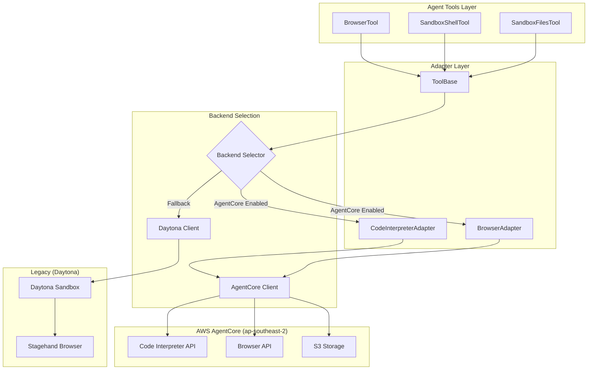
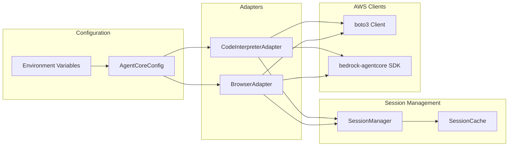

# Design Document: AgentCore Phase 1 Migration

## Overview

This design document describes the architecture and implementation approach for Phase 1 of the AWS Bedrock AgentCore migration. The migration replaces the current Daytona sandbox infrastructure with AWS AgentCore Code Interpreter and Browser primitives, with all services running exclusively in the Australia region (ap-southeast-2).

The migration follows a layered adapter pattern that allows transparent switching between Daytona and AgentCore backends while maintaining backward compatibility with existing tool implementations.

## Architecture

### High-Level Architecture



### Component Architecture



## Components and Interfaces

### 1. AgentCoreConfig (Enhanced)

Updates to the existing configuration to enforce Australia region and add new settings.

```python
@dataclass
class AgentCoreConfig:
    # Region enforcement - always ap-southeast-2
    aws_region: str = "ap-southeast-2"
    
    # Session configuration
    code_interpreter_session_timeout_seconds: int = 900
    browser_session_timeout_seconds: int = 900
    max_session_timeout_seconds: int = 28800
    
    # Retry configuration
    max_retries: int = 3
    retry_base_delay_seconds: float = 1.0
    retry_max_delay_seconds: float = 30.0
    
    # Recording configuration
    browser_recording_enabled: bool = False
    browser_recording_s3_bucket: Optional[str] = None
    browser_recording_s3_prefix: str = "browser-recordings"
    
    # IAM configuration
    code_interpreter_execution_role_arn: Optional[str] = None
    browser_execution_role_arn: Optional[str] = None
```

### 2. AgentCoreCodeInterpreterAdapter (Implementation)

Complete implementation wrapping the `bedrock_agentcore.tools.code_interpreter_client.CodeInterpreter` SDK.

```python
from bedrock_agentcore.tools.code_interpreter_client import CodeInterpreter, code_session

class AgentCoreCodeInterpreterAdapter:
    """Adapter for AgentCore Code Interpreter with session management.
    
    Wraps the bedrock-agentcore SDK CodeInterpreter client with:
    - Australia region enforcement (ap-southeast-2)
    - Project-based session management
    - Retry logic and error handling
    - Async interface for FastAPI compatibility
    """
    
    def __init__(self, config: Optional[AgentCoreConfig] = None):
        self.config = config or get_config()
        self._client: Optional[CodeInterpreter] = None
        
    def _get_client(self) -> CodeInterpreter:
        """Get or create CodeInterpreter client for ap-southeast-2."""
        if self._client is None:
            self._client = CodeInterpreter(region="ap-southeast-2")
        return self._client
    
    async def start_session(
        self,
        project_id: str,
        timeout_seconds: int = 900
    ) -> str:
        """Start a Code Interpreter session.
        
        Uses SDK: client.start(identifier, name, session_timeout_seconds)
        """
        
    async def invoke(
        self,
        method: str,
        params: Optional[Dict] = None
    ) -> Dict:
        """Invoke a method in the Code Interpreter.
        
        Methods: 'executeCode', 'listFiles', etc.
        Uses SDK: client.invoke(method, params)
        """
        
    async def execute_code(
        self,
        code: str,
        language: str = "python"
    ) -> CodeExecutionResult:
        """Execute code using invoke('executeCode', {...})."""
        
    async def stop_session(self) -> bool:
        """Stop the current session.
        
        Uses SDK: client.stop()
        """
```

### 3. AgentCoreBrowserAdapter (Implementation)

Complete implementation wrapping the `bedrock_agentcore.tools.browser_client.BrowserClient` SDK.

```python
from bedrock_agentcore.tools.browser_client import BrowserClient, browser_session
from playwright.async_api import async_playwright

class AgentCoreBrowserAdapter:
    """Adapter for AgentCore Browser with WebSocket/Playwright support.
    
    Wraps the bedrock-agentcore SDK BrowserClient with:
    - Australia region enforcement (ap-southeast-2)
    - Project-based session management
    - Playwright integration for browser automation
    - Screenshot upload to S3
    """
    
    def __init__(self, config: Optional[AgentCoreConfig] = None):
        self.config = config or get_config()
        self._client: Optional[BrowserClient] = None
        
    def _get_client(self) -> BrowserClient:
        """Get or create BrowserClient for ap-southeast-2."""
        if self._client is None:
            self._client = BrowserClient(region="ap-southeast-2")
        return self._client
    
    async def start_session(
        self,
        project_id: str,
        timeout_seconds: int = 900,
        viewport: Optional[Dict[str, int]] = None
    ) -> str:
        """Start a browser session.
        
        Uses SDK: client.start(identifier, name, session_timeout_seconds, viewport)
        """
        
    def generate_ws_headers(self) -> Tuple[str, Dict[str, str]]:
        """Generate WebSocket URL and authentication headers.
        
        Uses SDK: client.generate_ws_headers()
        Returns: (ws_url, headers) for Playwright CDP connection
        """
        
    async def connect_playwright(self) -> Page:
        """Connect Playwright to the browser via CDP.
        
        Uses: playwright.chromium.connect_over_cdp(ws_url, headers=headers)
        """
        
    async def navigate(self, url: str) -> NavigationResult:
        """Navigate to a URL using Playwright page.goto()."""
        
    async def take_screenshot(self, full_page: bool = False) -> ScreenshotResult:
        """Take screenshot using Playwright and upload to S3."""
        
    async def stop_session(self) -> bool:
        """Stop the browser session.
        
        Uses SDK: client.stop()
        """
        
    def generate_live_view_url(self, expires: int = 300) -> str:
        """Generate pre-signed URL for live viewing.
        
        Uses SDK: client.generate_live_view_url(expires)
        """
```

### 4. SessionManager

Manages session lifecycle across projects.

```python
class SessionManager:
    """Manages AgentCore sessions per project."""
    
    async def get_or_create_code_interpreter_session(
        self,
        project_id: str
    ) -> CodeInterpreterSession:
        """Get existing session or create new one."""
        
    async def get_or_create_browser_session(
        self,
        project_id: str
    ) -> BrowserSession:
        """Get existing browser session or create new one."""
        
    async def cleanup_project_sessions(
        self,
        project_id: str
    ) -> None:
        """Clean up all sessions for a project."""
        
    async def persist_session_metadata(
        self,
        project_id: str,
        session_type: str,
        metadata: Dict[str, Any]
    ) -> None:
        """Persist session metadata to database."""
```

### 5. SandboxToolsBase (Updated)

Updated base class to support AgentCore backend.

```python
class SandboxToolsBase(Tool):
    """Base class with AgentCore support."""
    
    async def _ensure_sandbox(self) -> Union[AsyncSandbox, CodeInterpreterSession]:
        """Get sandbox - AgentCore or Daytona based on config."""
        if self._use_agentcore():
            return await self._ensure_agentcore_session()
        return await self._ensure_daytona_sandbox()
    
    def _use_agentcore(self) -> bool:
        """Check if AgentCore should be used."""
        config = get_agentcore_config()
        return config.code_interpreter_enabled
    
    async def _ensure_agentcore_session(self) -> CodeInterpreterSession:
        """Ensure AgentCore Code Interpreter session exists."""
```

## Data Models

### Session Models

```python
@dataclass
class CodeInterpreterSession:
    session_id: str
    project_id: str
    region: str
    created_at: datetime
    timeout_seconds: int
    status: SessionStatus
    
    def to_dict(self) -> Dict[str, Any]:
        """Serialize to dictionary."""
        
    @classmethod
    def from_dict(cls, data: Dict[str, Any]) -> "CodeInterpreterSession":
        """Deserialize from dictionary."""

@dataclass
class BrowserSession:
    session_id: str
    project_id: str
    region: str
    created_at: datetime
    timeout_seconds: int
    status: SessionStatus
    recording_enabled: bool
    recording_s3_path: Optional[str]
    
    def to_dict(self) -> Dict[str, Any]:
        """Serialize to dictionary."""
        
    @classmethod
    def from_dict(cls, data: Dict[str, Any]) -> "BrowserSession":
        """Deserialize from dictionary."""

class SessionStatus(str, Enum):
    CREATING = "creating"
    READY = "ready"
    RUNNING = "running"
    STOPPED = "stopped"
    ERROR = "error"
```

### Result Models

```python
@dataclass
class CodeExecutionResult:
    output: str
    error: Optional[str]
    exit_code: int
    files_created: List[str]
    execution_time_ms: int
    
    def to_dict(self) -> Dict[str, Any]:
        """Serialize to dictionary."""
        
    @classmethod
    def from_dict(cls, data: Dict[str, Any]) -> "CodeExecutionResult":
        """Deserialize from dictionary."""

@dataclass
class ShellCommandResult:
    stdout: str
    stderr: str
    exit_code: int
    execution_time_ms: int
    
    def to_dict(self) -> Dict[str, Any]:
        """Serialize to dictionary."""
        
    @classmethod
    def from_dict(cls, data: Dict[str, Any]) -> "ShellCommandResult":
        """Deserialize from dictionary."""

@dataclass
class NavigationResult:
    url: str
    title: str
    screenshot_url: Optional[str]
    status_code: int
    
    def to_dict(self) -> Dict[str, Any]:
        """Serialize to dictionary."""
        
    @classmethod
    def from_dict(cls, data: Dict[str, Any]) -> "NavigationResult":
        """Deserialize from dictionary."""

@dataclass
class ActionResult:
    success: bool
    message: str
    screenshot_url: Optional[str]
    url: str
    title: str
    
    def to_dict(self) -> Dict[str, Any]:
        """Serialize to dictionary."""
        
    @classmethod
    def from_dict(cls, data: Dict[str, Any]) -> "ActionResult":
        """Deserialize from dictionary."""

@dataclass
class ExtractionResult:
    data: Any
    success: bool
    error: Optional[str]
    
    def to_dict(self) -> Dict[str, Any]:
        """Serialize to dictionary."""
        
    @classmethod
    def from_dict(cls, data: Dict[str, Any]) -> "ExtractionResult":
        """Deserialize from dictionary."""

@dataclass
class ScreenshotResult:
    screenshot_url: str
    width: int
    height: int
    
    def to_dict(self) -> Dict[str, Any]:
        """Serialize to dictionary."""
        
    @classmethod
    def from_dict(cls, data: Dict[str, Any]) -> "ScreenshotResult":
        """Deserialize from dictionary."""
```


## Correctness Properties

*A property is a characteristic or behavior that should hold true across all valid executions of a system-essentially, a formal statement about what the system should do. Properties serve as the bridge between human-readable specifications and machine-verifiable correctness guarantees.*

### Property 1: Region Enforcement

*For any* AgentCore configuration input, regardless of the specified region value, the resulting configuration SHALL have aws_region set to "ap-southeast-2".

**Validates: Requirements 1.1, 1.3, 9.4**

### Property 2: Backend Selection Consistency

*For any* combination of AGENTCORE_CODE_INTERPRETER_ENABLED and AGENTCORE_BROWSER_ENABLED configuration flags, the backend selection logic SHALL return AgentCore adapters when the respective flag is true, and Daytona/Stagehand when false.

**Validates: Requirements 8.1, 8.2, 8.3, 9.1, 9.2**

### Property 3: Session State Round-Trip Serialization

*For any* valid CodeInterpreterSession or BrowserSession object, serializing to JSON and then deserializing SHALL produce an equivalent session object with identical field values.

**Validates: Requirements 11.1, 11.2, 11.3**

### Property 4: Code Execution Result Round-Trip Serialization

*For any* valid CodeExecutionResult or ShellCommandResult object, serializing to JSON and then deserializing SHALL produce an equivalent result object with identical field values.

**Validates: Requirements 12.1, 12.2, 12.3**

### Property 5: Browser Result Round-Trip Serialization

*For any* valid NavigationResult, ActionResult, ExtractionResult, or ScreenshotResult object, serializing to JSON and then deserializing SHALL produce an equivalent result object with identical field values.

**Validates: Requirements 13.1, 13.2, 13.3**

### Property 6: Code Execution Result Structure Completeness

*For any* CodeExecutionResult, the object SHALL contain non-null values for output (string), exit_code (integer), and execution_time_ms (integer). For ShellCommandResult, the object SHALL contain stdout, stderr, and exit_code.

**Validates: Requirements 2.2, 2.3, 2.5, 3.4**

### Property 7: Browser Result Structure Completeness

*For any* NavigationResult, the object SHALL contain url and title. For ActionResult, the object SHALL contain success, message, and url. For error responses, the object SHALL contain an error field with a non-empty message.

**Validates: Requirements 4.2, 4.3, 5.4, 5.5, 6.2, 6.3, 7.2, 7.3, 20.3**

### Property 8: Variable Substitution Correctness

*For any* action string containing variable placeholders in the format %variable_name% and a corresponding variables dictionary, the substitution SHALL replace all placeholders with their dictionary values, and placeholders without matching keys SHALL remain unchanged.

**Validates: Requirements 5.2**

### Property 9: Retry Logic for Retryable Errors

*For any* retryable error (connection timeout, rate limit, service unavailable), the retry handler SHALL attempt the operation up to max_retries times with exponential backoff delays.

**Validates: Requirements 15.1**

### Property 10: Retry Logic Max Retries Exceeded

*For any* operation that fails max_retries consecutive times, the retry handler SHALL return the final error to the caller without further retry attempts.

**Validates: Requirements 15.2**

### Property 11: Retry Logic for Non-Retryable Errors

*For any* non-retryable error (authentication failure, invalid request, resource not found), the retry handler SHALL return the error immediately without any retry attempts.

**Validates: Requirements 15.3**

### Property 12: Sensitive Data Redaction

*For any* log message containing patterns matching AWS credentials, API keys, or passwords, the redaction function SHALL replace the sensitive values with "[REDACTED]" while preserving the rest of the message.

**Validates: Requirements 16.4**

### Property 13: Session Timeout Validation

*For any* timeout value, the validation SHALL accept values between 60 and 28800 seconds (inclusive), reject values outside this range, and use 900 seconds as the default when no value is specified.

**Validates: Requirements 21.1, 21.2, 21.4**

### Property 14: Non-Blocking Command Session Identifier

*For any* non-blocking command execution, the result SHALL contain a non-empty session_id that can be used to check output or terminate the command.

**Validates: Requirements 14.2**

### Property 15: Session Created Timestamp

*For any* newly created CodeInterpreterSession or BrowserSession, the created_at field SHALL be set to a timestamp within 1 second of the current time.

**Validates: Requirements 18.1**

### Property 16: WebSocket URL Generation

*For any* browser session, the generate_ws_headers method SHALL return a tuple containing a valid WebSocket URL (starting with "wss://") and a non-empty headers dictionary with authentication information.

**Validates: Requirements 20.1**

### Property 17: Recording-Enabled Session S3 Path

*For any* BrowserSession created with recording_enabled=True, the recording_s3_path field SHALL be a non-empty string containing the S3 bucket and prefix path.

**Validates: Requirements 23.3**

### Property 18: Streaming Event Structure

*For any* streaming code execution event, the event SHALL contain a type field (one of "output", "error", "complete") and a content field. Partial results from failed streams SHALL include an error_indicator field.

**Validates: Requirements 22.2, 22.4**

## Error Handling

### Error Categories

```python
class AgentCoreError(Exception):
    """Base exception for AgentCore operations."""
    pass

class AgentCoreConfigurationError(AgentCoreError):
    """Configuration-related errors."""
    pass

class AgentCoreSessionError(AgentCoreError):
    """Session lifecycle errors."""
    pass

class AgentCoreExecutionError(AgentCoreError):
    """Code/command execution errors."""
    pass

class AgentCoreBrowserError(AgentCoreError):
    """Browser operation errors."""
    pass

class AgentCoreTimeoutError(AgentCoreError):
    """Timeout errors."""
    pass

class AgentCoreRetryableError(AgentCoreError):
    """Errors that can be retried."""
    retryable = True

class AgentCoreNonRetryableError(AgentCoreError):
    """Errors that should not be retried."""
    retryable = False
```

### Retry Strategy

```python
RETRYABLE_ERRORS = [
    "ThrottlingException",
    "ServiceUnavailableException", 
    "InternalServerException",
    "ConnectionError",
    "TimeoutError",
]

NON_RETRYABLE_ERRORS = [
    "ValidationException",
    "AccessDeniedException",
    "ResourceNotFoundException",
    "InvalidRequestException",
]

async def with_retry(
    operation: Callable,
    max_retries: int = 3,
    base_delay: float = 1.0,
    max_delay: float = 30.0
) -> Any:
    """Execute operation with exponential backoff retry."""
    for attempt in range(max_retries + 1):
        try:
            return await operation()
        except Exception as e:
            if not is_retryable(e) or attempt == max_retries:
                raise
            delay = min(base_delay * (2 ** attempt), max_delay)
            await asyncio.sleep(delay)
```

### Fallback Behavior

When AgentCore operations fail and fallback is enabled:

1. Log the AgentCore error with full details
2. Check if fallback is enabled in configuration
3. Attempt the operation using Daytona/Stagehand
4. If fallback also fails, raise the original AgentCore error

## Testing Strategy

### Dual Testing Approach

This implementation uses both unit tests and property-based tests:

- **Unit tests**: Verify specific examples, edge cases, and integration points
- **Property-based tests**: Verify universal properties that should hold across all inputs

### Property-Based Testing Framework

**Framework**: `hypothesis` (Python property-based testing library)

**Configuration**:
```python
from hypothesis import settings, given, strategies as st

# Configure minimum 100 iterations per property test
settings.register_profile("ci", max_examples=100)
settings.load_profile("ci")
```

### Test Organization

```
core/agentcore/tests/
├── __init__.py
├── conftest.py                    # Shared fixtures and strategies
├── test_config.py                 # Configuration tests
├── test_config_properties.py      # Property tests for config
├── test_code_interpreter.py       # Code Interpreter unit tests
├── test_code_interpreter_props.py # Property tests for Code Interpreter
├── test_browser.py                # Browser unit tests
├── test_browser_properties.py     # Property tests for Browser
├── test_session_manager.py        # Session management tests
├── test_serialization_props.py    # Round-trip serialization properties
├── test_retry_logic.py            # Retry logic tests
└── test_integration.py            # Integration tests (requires AWS)
```

### Property Test Annotations

Each property-based test MUST include a comment referencing the correctness property:

```python
# **Feature: agentcore-phase1-migration, Property 1: Region Enforcement**
@given(region=st.text())
def test_region_always_australia(region):
    """Region is always ap-southeast-2 regardless of input."""
    config = AgentCoreConfig(aws_region=region)
    assert config.aws_region == "ap-southeast-2"
```

### Test Data Generators

```python
# Hypothesis strategies for generating test data
session_id_strategy = st.text(min_size=1, max_size=64, alphabet=st.characters(whitelist_categories=('L', 'N')))
project_id_strategy = st.uuids().map(str)
timeout_strategy = st.integers(min_value=1, max_value=100000)
code_strategy = st.text(min_size=0, max_size=10000)
url_strategy = st.from_regex(r'https?://[a-z0-9.-]+\.[a-z]{2,}(/[a-z0-9/-]*)?', fullmatch=True)
```

### Integration Test Requirements

Integration tests require:
- AWS credentials with AgentCore permissions
- S3 bucket in ap-southeast-2
- Network access to AWS endpoints

Integration tests are marked with `@pytest.mark.integration` and skipped in CI without credentials.
