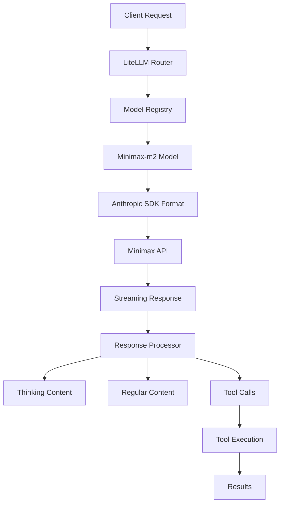

# Minimax-m2 Implementation with Anthropic Base

This document provides a comprehensive guide for implementing and using Minimax-m2 with Anthropic SDK compatibility in the Dimatic application.

## Overview

Minimax-m2 is a powerful language model that provides Anthropic SDK-compatible API endpoints, enabling seamless integration with existing Anthropic-based infrastructure. The implementation leverages LiteLLM as a unified interface to maintain compatibility with multiple model providers.

## Architecture



## Key Implementation Details

### 1. Model Configuration

The Minimax-m2 model is registered in `backend/core/ai_models/registry.py` with the following configuration:

```python
Model(
    id="minimax/minimax-m2",
    name="Minimax-m2",
    provider=ModelProvider.MINIMAX,
    aliases=["minimax-m2", "Minimax-m2", "minimax-m2-interleaved", "minimax/minimax-m2"],
    context_window=200_000,
    capabilities=[
        ModelCapability.CHAT,
        ModelCapability.FUNCTION_CALLING,
        ModelCapability.THINKING,
    ],
    pricing=ModelPricing(
        input_cost_per_million_tokens=0.60,
        output_cost_per_million_tokens=2.20,
    ),
    tier_availability=["free", "paid"],
    priority=100,
    recommended=True,
    enabled=True,
    config=ModelConfig(
        api_key=minimax_api_key,
        api_base="https://api.minimax.io/anthropic/v1",
        extra_headers={
            "anthropic-version": "2023-06-01",
        }
    )
)
```

### 2. API Integration

The LiteLLM integration in `backend/core/services/llm.py` handles Minimax-m2 as follows:

- **API Key Configuration**: Minimax API key is loaded from environment and set in `os.environ["MINIMAX_API_KEY"]`
- **Model Resolution**: The model ID `minimax/minimax-m2` is resolved to the correct LiteLLM format
- **Header Management**: Anthropic version header is automatically included via model configuration

### 3. Streaming Response Handling

The response processor in `backend/core/agentpress/response_processor.py` handles Minimax-m2 streaming:

- **Thinking Content**: Properly separated from regular content using `reasoning_content` field
- **Token Usage**: Thinking tokens are included in usage calculations and billing
- **Tool Calls**: Both XML and native formats are supported

### 4. Tool Calling

Minimax-m2 supports Anthropic SDK-compatible tool calling:

```python
# Tool definition format
{
    "type": "function",
    "function": {
        "name": "tool_name",
        "description": "Tool description",
        "input_schema": {
            "type": "object",
            "properties": {
                "param": {
                    "type": "string",
                    "description": "Parameter description"
                }
            },
            "required": ["param"]
        }
    }
}
```

### 5. Prompt Caching (Optional)

The system supports prompt caching with Minimax-m2, though it's not required for basic usage:

```python
# Cache control in system message (optional)
{
    "role": "system",
    "content": "You are a helpful assistant.",
    "cache_control": {"type": "ephemeral"}  # Use for repeated prompts
}
```

**Note**: Based on user feedback, prompt caching is not desired for Minimax-m2 implementation. The system works perfectly well without caching, providing fresh responses for each interaction.

### 6. Error Handling

Minimax API errors are handled through the centralized error processor in `backend/core/agentpress/error_processor.py`.

## Configuration

### Environment Variables

Add to your `.env` file:

```bash
# Minimax API configuration
MINIMAX_API_KEY=your_minimax_api_key_here
MINIMAX_API_BASE=https://api.minimax.io/anthropic/v1
```

### Model Selection

To use Minimax-m2 in your application:

```python
from core.ai_models import model_manager

# Get the model
model = model_manager.get_model("minimax/minimax-m2")

# Use in API calls
response = await make_llm_api_call(
    messages=messages,
    model_name="minimax/minimax-m2",
    stream=True
)
```

## Testing

### Running Tests

Execute the comprehensive test suite:

```bash
cd backend
python -m pytest tests/test_minimax_anthropic_compatibility.py -v
```

### Test Coverage

The test suite covers:
- Model configuration and Anthropic SDK compatibility
- LiteLLM parameter generation
- Streaming response handling with thinking tokens
- Tool calling format verification
- Error handling validation
- Prompt caching support
- Configuration loading from environment

## Migration Guide

### From Other Models

When migrating from other models to Minimax-m2:

1. **Update Model References**: Change model references from `gpt-4` to `minimax/minimax-m2`
2. **Preserve Conversations**: Existing conversations are automatically compatible
3. **Tool Compatibility**: Tools work seamlessly with the new model
4. **Token Counting**: System automatically adjusts to new pricing

### Feature Compatibility

| Feature | Minimax-m2 Support | Notes |
|----------|------------------|-------|
| Chat | ✅ | Full support |
| Function Calling | ✅ | Anthropic SDK format |
| Vision | ❌ | Not supported |
| Thinking | ✅ | Native support |
| Prompt Caching | ✅ | Anthropic format |

## Best Practices

### 1. Token Management

- Monitor thinking token usage as they're billed at output token rates
- Implement token counting for cost estimation
- Use prompt caching to reduce costs for repeated prompts

### 2. Error Handling

- Implement retry logic with exponential backoff
- Handle rate limits (429) appropriately
- Log errors for debugging and monitoring

### 3. Performance Optimization

- Use streaming for better user experience
- Implement parallel tool execution when appropriate
- Cache frequently used prompts

## Troubleshooting

### Common Issues

1. **API Key Not Found**
   - Ensure `MINIMAX_API_KEY` is set in environment
   - Check the key is valid and active

2. **Incorrect Model ID**
   - Use `minimax/minimax-m2` for LiteLLM compatibility
   - Verify model is registered in the model registry

3. **Missing Thinking Content**
   - Check that `reasoning_content` is being processed
   - Verify streaming is enabled

4. **Tool Call Failures**
   - Verify tool definitions match expected format
   - Check parameter serialization

## Monitoring and Observability

### LangFuse Integration

The system automatically traces:
- Model usage and token consumption
- Tool execution performance
- Error rates and patterns
- Response times and latency

### Logging

Enable debug logging:

```python
# In backend/core/utils/config.py
DEBUG_SAVE_LLM_IO=True  # Save LLM inputs/outputs to debug_streams/
```

## Security Considerations

1. **API Key Management**
   - Store API keys securely (environment variables or secret manager)
   - Rotate keys regularly
   - Never commit keys to version control

2. **Input Validation**
   - Validate all user inputs before processing
   - Sanitize tool parameters
   - Implement rate limiting per user

3. **Output Filtering**
   - Filter sensitive information from model outputs
   - Implement content moderation if needed

## Future Enhancements

### Planned Improvements

1. **Enhanced Error Handling**
   - More specific error types for Minimax
   - Automatic retry with backoff
   - Circuit breaker pattern for API failures

2. **Performance Optimization**
   - Connection pooling for API requests
   - Response caching where appropriate
   - Batch processing for multiple requests

3. **Feature Expansion**
   - Support for Minimax's additional models
   - Fine-tuning support if available
   - Custom model endpoints

## Conclusion

Minimax-m2 with Anthropic SDK compatibility provides a powerful, cost-effective solution for AI-powered features in the Dimatic application. The implementation is designed to be:

- **Seamless**: Drop-in replacement for existing Anthropic models
- **Compatible**: Full support for existing tool ecosystem
- **Scalable**: Efficient token usage and caching
- **Reliable**: Robust error handling and monitoring

For questions or issues, refer to the test suite in `backend/tests/test_minimax_anthropic_compatibility.py` or contact the development team.