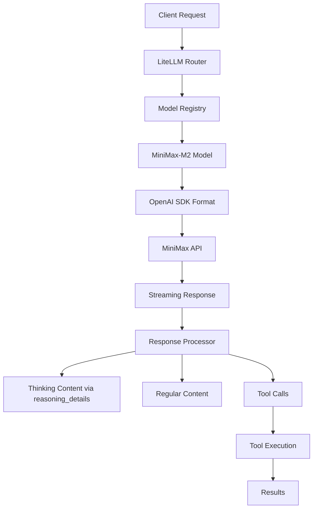

# MiniMax-M2 Implementation with OpenAI-Compatible API

This document provides a comprehensive guide for implementing and using MiniMax-M2 with OpenAI SDK compatibility in the Dimatic application.

## Overview

MiniMax-M2 is a powerful language model that provides OpenAI SDK-compatible API endpoints, enabling seamless integration with existing OpenAI-based infrastructure. The implementation leverages LiteLLM as a unified interface to maintain compatibility with multiple model providers.

## Architecture



## Key Implementation Details

### 1. Model Configuration

The MiniMax-M2 model is registered in `backend/core/ai_models/registry.py` with the following configuration:

```python
Model(
    id="openai/MiniMax-M2",
    name="MiniMax-M2",
    provider=ModelProvider.MINIMAX,
    aliases=["minimax-m2", "MiniMax-M2", "Minimax-m2", "minimax-m2-interleaved", "minimax/minimax-m2", "openai/minimax-m2"],
    context_window=200_000,
    capabilities=[
        ModelCapability.CHAT,
        ModelCapability.FUNCTION_CALLING,
        ModelCapability.THINKING,
    ],
    pricing=ModelPricing(
        input_cost_per_million_tokens=0.60,
        output_cost_per_million_tokens=2.20,
    ),
    tier_availability=["free", "paid"],
    priority=100,
    recommended=True,
    enabled=True,
    config=ModelConfig(
        api_key=minimax_api_key,
        api_base="https://api.minimax.io/v1",
    )
)
```

### 2. API Integration

The LiteLLM integration in `backend/core/services/llm.py` handles MiniMax-M2 as follows:

- **API Key Configuration**: MiniMax API key is loaded from environment and set in `os.environ["MINIMAX_API_KEY"]`
- **Model Resolution**: The model ID `openai/MiniMax-M2` is resolved to the correct LiteLLM format
- **OpenAI Compatibility**: Uses standard OpenAI SDK format without extra headers

### 3. Streaming Response Handling

The response processor in `backend/core/agentpress/response_processor.py` handles MiniMax-M2 streaming:

- **Thinking Content**: Separated from regular content using `reasoning_details` field (with `reasoning_split=True`)
- **Token Usage**: Thinking tokens are included in usage calculations and billing
- **Tool Calls**: OpenAI-style native function calling is supported

### 4. Thinking Content with reasoning_split

MiniMax-M2 supports interleaved thinking via the `reasoning_split` parameter:

```python
# Enable reasoning_split to separate thinking content
response = client.chat.completions.create(
    model="MiniMax-M2",
    messages=[
        {"role": "system", "content": "You are a helpful assistant."},
        {"role": "user", "content": "Hi, how are you?"},
    ],
    extra_body={"reasoning_split": True},  # Separates thinking into reasoning_details
)

# Access thinking content
print(f"Thinking: {response.choices[0].message.reasoning_details[0]['text']}")
print(f"Response: {response.choices[0].message.content}")
```

### 5. Tool Calling

MiniMax-M2 supports OpenAI SDK-compatible tool calling:

```python
# Tool definition format (OpenAI style)
{
    "type": "function",
    "function": {
        "name": "tool_name",
        "description": "Tool description",
        "parameters": {
            "type": "object",
            "properties": {
                "param": {
                    "type": "string",
                    "description": "Parameter description"
                }
            },
            "required": ["param"]
        }
    }
}
```

### 6. Error Handling

MiniMax API errors are handled through the centralized error processor in `backend/core/agentpress/error_processor.py`.

## Configuration

### Environment Variables

Add to your `.env` file:

```bash
# MiniMax API configuration (OpenAI-compatible)
MINIMAX_API_KEY=your_minimax_api_key_here
MINIMAX_API_BASE=https://api.minimax.io/v1
```

### Model Selection

To use MiniMax-M2 in your application:

```python
from core.ai_models import model_manager

# Get the model (via alias)
model = model_manager.get_model("minimax/minimax-m2")

# Use in API calls
response = await make_llm_api_call(
    messages=messages,
    model_name="minimax/minimax-m2",
    stream=True
)
```

## Testing

### Running Tests

Execute the comprehensive test suite:

```bash
cd backend
python -m pytest tests/test_minimax_openai_compatibility.py -v
```

### Test Coverage

The test suite covers:
- Model configuration and OpenAI SDK compatibility
- LiteLLM parameter generation
- Streaming response handling with thinking tokens (reasoning_details)
- Tool calling format verification
- Error handling validation
- Configuration loading from environment

## Migration Guide

### From Anthropic-Compatible API

When migrating from the Anthropic-compatible API to OpenAI-compatible:

1. **Update API Base**: Change from `https://api.minimax.io/anthropic/v1` to `https://api.minimax.io/v1`
2. **Update Model ID**: Change from `anthropic/minimax-m2` to `openai/MiniMax-M2`
3. **Remove Extra Headers**: No longer need `anthropic-version` header
4. **Update Tool Format**: Use `parameters` instead of `input_schema` in tool definitions
5. **Update Thinking Handling**: Use `reasoning_details` instead of `reasoning_content`

### Feature Compatibility

| Feature | MiniMax-M2 Support | Notes |
|----------|------------------|-------|
| Chat | ✅ | Full support |
| Function Calling | ✅ | OpenAI SDK format |
| Vision | ❌ | Not supported |
| Thinking | ✅ | Via reasoning_details with reasoning_split=True |
| Streaming | ✅ | Full support |

## Best Practices

### 1. Token Management

- Monitor thinking token usage as they're billed at output token rates
- Implement token counting for cost estimation
- Use `reasoning_split=True` to properly separate thinking content

### 2. Error Handling

- Implement retry logic with exponential backoff
- Handle rate limits (429) appropriately
- Log errors for debugging and monitoring

### 3. Performance Optimization

- Use streaming for better user experience
- Implement parallel tool execution when appropriate

## Troubleshooting

### Common Issues

1. **API Key Not Found**
   - Ensure `MINIMAX_API_KEY` is set in environment
   - Check the key is valid and active

2. **Incorrect Model ID**
   - Use `openai/MiniMax-M2` for LiteLLM compatibility
   - Verify model is registered in the model registry

3. **Missing Thinking Content**
   - Ensure `reasoning_split=True` is set in extra_body
   - Check that `reasoning_details` is being processed

4. **Tool Call Failures**
   - Verify tool definitions use `parameters` (not `input_schema`)
   - Check parameter serialization

## Important Notes

### Temperature Parameter

The `temperature` parameter range is (0.0, 1.0], with recommended value: 1.0. Values outside this range will return an error.

### Unsupported Parameters

Some OpenAI parameters are ignored:
- `presence_penalty`
- `frequency_penalty`
- `logit_bias`

### Multi-turn Function Calls

In multi-turn function call conversations, the complete model response (including the `tool_calls` field) must be appended to the conversation history to maintain the continuity of the reasoning chain.

## Monitoring and Observability

### LangFuse Integration

The system automatically traces:
- Model usage and token consumption
- Tool execution performance
- Error rates and patterns
- Response times and latency

### Logging

Enable debug logging:

```python
# In backend/core/utils/config.py
DEBUG_SAVE_LLM_IO=True  # Save LLM inputs/outputs to debug_streams/
```

## Security Considerations

1. **API Key Management**
   - Store API keys securely (environment variables or secret manager)
   - Rotate keys regularly
   - Never commit keys to version control

2. **Input Validation**
   - Validate all user inputs before processing
   - Sanitize tool parameters
   - Implement rate limiting per user

## Conclusion

MiniMax-M2 with OpenAI SDK compatibility provides a powerful, cost-effective solution for AI-powered features in the Dimatic application. The implementation is designed to be:

- **Seamless**: Drop-in replacement for existing OpenAI models
- **Compatible**: Full support for existing tool ecosystem
- **Scalable**: Efficient token usage
- **Reliable**: Robust error handling and monitoring

For questions or issues, refer to the test suite in `backend/tests/test_minimax_openai_compatibility.py` or contact the development team.
